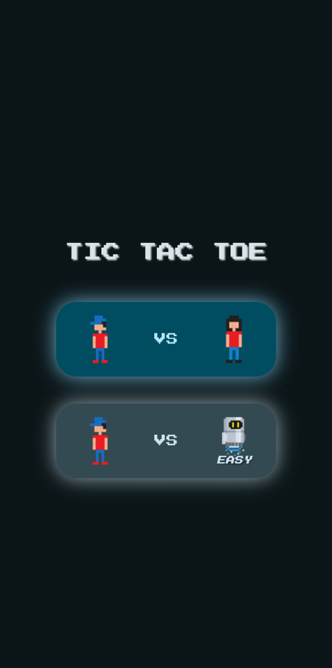
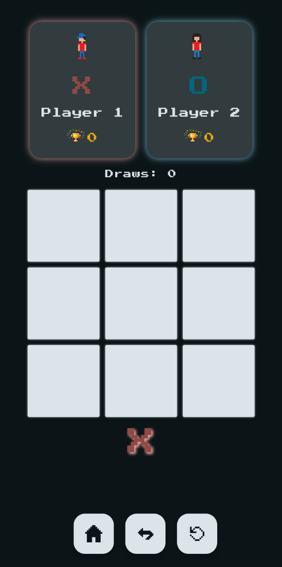

# Tic Tac Toe Kata Implementation - 2024-DEV2-020

<p float="left">
  
   
</p>

## Approach for [Kata](https://github.com/stephane-genicot/katas/blob/master/TicTacToe.md]) 

I implemented a scalable Tic-Tac-Toe solution by breaking down the game into granular components (e.g., TicTacToe3x3 vs Game/TicTacToe). Following TDD, I began with comprehensive unit tests that fail before implementing a component. The domain model classes are immutable data classes, the functions that "change state" return an updated deep copy of the class; this pattern works well for Jetpack Compose recompositions (among other benefits). The code is separated in packages respecting MVVM architecture. Hilt injects the main TicTacToe3x3 object into a ViewModel, orchestrating unidirectional data flow to the Jetpack Compose UI.


## Tech Stack
- Language: **Kotlin**
- UI: **Jetpack Compose**, **Compose Navigation**
- Architecture: **Single Activity UI Architecture**, **MVVM pattern**
- Testing: **JUnit**
- Dependency Injection: **Hilt**
- Build System: **Gradle**
- Code Quality: **Ktlint**

## Building the project
1. Clone the repository:
```bash
git clone https://github.com/2024-DEV2-020/tic-tac-toe-kata.git
```

2. Open the project in Android Studio

3. Build the project via the IDE UI or CLI (if it's not done automatically):
```bash
./gradlew build
```

## Running the App
1. Connect a physical Android device or start an emulator (Android 7.0 up to Android 15)
2. Run the app via the IDE UI green play button or via the CLI:
```bash
./gradlew installDebug
```

Alternatively, download and install the debug APK, from the github releases tab, on an Android device/emulator.

## Running the Tests
Android tests are in `app/src/androidTest/java/com`, JUnit tests are in `app/src/test/java/com`. Run via UI or:
```bash
./gradlew test
```
